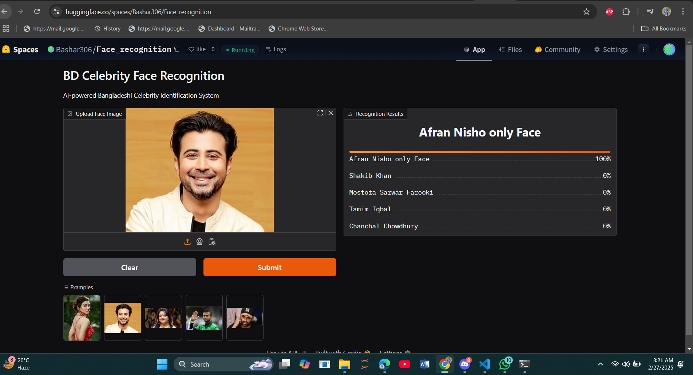

# Bangladeshi Celebrity Face Recognizer

Welcome to the **Bangladeshi Celebrity Face Recognizer**! This innovative system leverages cutting-edge AI technology to accurately identify and recognize the faces of 19 iconic Bangladeshi celebrities from various sectors, including film, music, sports, and television.

## 🌟 Features
- Recognizes **19 Bangladeshi celebrities** with high accuracy.
- Uses **FastAI ResNet34** for face recognition.
- Web-based application deployed on **Hugging Face Spaces**.
- Interactive UI for easy image uploads and real-time predictions.

## 🚀 How It Works
1. Upload an image containing a face.
2. The model processes the image and predicts the closest match among the 19 pre-trained celebrities.
3. Results are displayed instantly!

## 🎯 Purpose of the System
This project showcases the power of AI in recognizing and celebrating the diverse talents of Bangladesh. It’s more than just a tool—it’s a tribute to cultural icons who inspire millions.

## 🏆 Why Only 19 Celebrities?
To ensure precision and reliability, the system currently supports 19 celebrities. This helps maintain high accuracy while leaving room for future expansion.

## 🖼️ List of Recognizable Celebrities
- Afran Nisho
- Afsana Mimi
- Arfin Shuvoo
- Ayub Bachchu
- Chanchal Chowdhury
- Dr. Muhammad Yunus
- Fazle Hasan Abed
- Humayun Ahmed
- James (Nagar Baul)
- Joya Ahsan
- Mashrafe Bin Mortaza
- Mizanur Rahman Azhari
- Mostofa Sarwar Farooki
- Sabina Khatun
- Sabina Yasmin
- Shakib Al Hasan
- Shakib Khan
- Tahsan Khan
- Tamim Iqbal

## 🔗 Live Demo & Resources
  
  
  
  
  

## 📂 Repository Structure

### 🗂 Data Collection & Processing
[📁 Data Collection Folder](Data_collection_&_process_code/)

### 🚀 Deployment (Hugging Face)
[📁 Deployment Folder](deployment/)

### 📄 GitHub Pages Documentation
[📁 Docs Folder](docs/)

### 🔍 Hugging Face Deployment Sample

## 🛠️ Model Training
- The model is trained using **FastAI ResNet34**.
- Dataset consists of curated celebrity images.
- Fine-tuned on facial recognition tasks for high accuracy.

## 📜 License
This project is open-source and available for educational and research purposes.

## 👨‍💻 Author
**Nurul Bashar**

---
🎉 **Enjoy using the Bangladeshi Celebrity Face Recognizer!** Feel free to contribute and improve the system. 🚀
